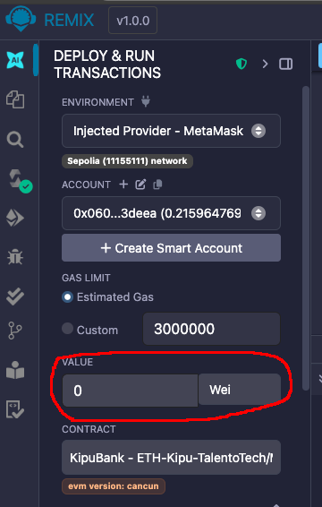

# Kipu Bank

## Descripción

KipuBank es un contrato inteligente basado en Ethereum para gestionar depósitos y retiros de ETH. Los usuarios pueden depositar ETH en sus cuentas dentro del banco y retirar fondos mientras cumplen con ciertas reglas, como un límite global en los depósitos totales, un límite de transacción para retiros y la prevención de acceso no autorizado.

### Características Clave
- **Funcionalidad de Depósito:** Los usuarios pueden depositar ETH.
- **Funcionalidad de Retiro:** Los usuarios pueden retirar ETH con límites en las cantidades de retiro por transacción.
- **Consulta de Saldo:** Los usuarios pueden verificar su saldo actual.
- **Límite Global de Depósitos:** El contrato tiene un límite global para limitar los depósitos totales.
- **Prevención de Acceso No Autorizado:** El contrato incluye controles de acceso para ataques de reentracy.

## Instrucciones de Despliegue

### Requisitos Previos
1. **Remix IDE**: Asegúrate de tener acceso a Remix IDE, una plataforma en línea para desarrollar contratos inteligentes Ethereum. Puedes acceder a ella en [remix.ethereum.org](https://remix.ethereum.org/).

### Pasos para Desplegar

1. **Abrir Remix IDE**:
   - Ve al sitio web de [Remix IDE](https://remix.ethereum.org/) y abre una nueva pestaña del entorno de trabajo.

2. **Crear un Nuevo Archivo de Contrato**:
   - En el explorador de archivos de Remix, haz clic derecho en la carpeta `contracts` y selecciona "Nuevo archivo".
   - Nombra el archivo `KipuBank.sol`.

3. **Copiar y Pegar el Código del Contrato**:
   - Copia el código del contrato KipuBank que proporcionamos y pégalo en el nuevo archivo `KipuBank.sol` en Remix.

4. **Compilar el Contrato**:
   - Ve a la pestaña "Solidity Compiler" en Remix.
   - Selecciona la versión del compilador Solidity compatible (por ejemplo, 0.8.28).
   - Haz clic en "Compilar KipuBank.sol".

5. **Desplegar el Contrato**:
   - Ve a la pestaña "Deploy & Run Transactions" en Remix.
   - En el menu desplegable de ENVIRONMENT, seleccionar y configura tu entorno de red (por ejemplo, Rinkeby Test Network). por ejemplo para deployar en sepolia testnet seleccionar "browser Extension" > "Injected Provider - MetaMask" y seleccionar la cuenta metamask asociada a Sepolia testnet.
   - Introduce los parámetros necesarios para el contrato (`bankCap`), el parametro es un valor entero en Wei, por ejemplo `bankCap`: `1000000000000000` Wei (0.001 ETH) 
   - Haz clic en "Deploy".
   - Si seleccionaste Metamask, se abrira la extension para que confirmes la transaccion.

#### Pasos para Interactuar con el Contrato

1. **Desplegar el Contrato**:
   - Una vez desplegado el contrato, verás una lista de funciones que puedes interactuar en la sección inferior de Remix IDE.

2. **Depósito de ETH**:
   - Seleccionar la address con cual operar.
   - Encuentra la funcion `deposit` en la lista de funciones desplegadas.
   - Introduce la cantidad de ETH que deseas depositar (en Wei), incluyendo el mismo monto en el parametro de la funcion. Son 2 campos.

   />
   - Haz clic en el botón `transact` ubicado al ultimo scrolleando hacia abajo.
   - Confirmar la transaccion con Metamask.

3. **Verificar Saldo**:
   - Encuentra la función `getBalance` en la lista de funciones desplegadas y has click.
   - Justo debajo de boton se mostrara tu saldo actual en el contrato en Weis.

4. **Retiro de ETH**:
   - Encuentra la función `withdraw` en la lista de funciones desplegadas.
   - Introduce la cantidad de ETH que deseas retirar y haz clic en "transact".
   - <b>Importante no retirar más ETH del que tienes disponible y no superar el limite de extraccion por transaccion o la operacion se revertira.</b>
   - confirmar la transaccion con Metamask

## Información del Contrato

- **Límite de Retiro**: Cantidad máxima de ETH que los usuarios pueden retirar en una sola transacción (en wei).
- **Capacidad del Banco**: Límite global de depósitos (en wei).

## Conclusión

KipuBank proporciona una manera segura y sencilla de manejar depósitos y retiros de ETH en la blockchain de Ethereum. El contrato inteligente incluye mecanismos para prevenir el acceso no autorizado, gestionar límites globales y asegurar transacciones seguras.

## Direccion del contrato en Sepolia testnet:
- Direccion contrato: `0x1c7212658C2Dc1719f5dB7Ad064415Ce2e473Bf8`.
- [Link deploy Sepolia Etherscan](https://sepolia.etherscan.io/address/0x1c7212658c2dc1719f5db7ad064415ce2e473bf8)

## Changelog

[link Changelog](CHANGELOG.md)